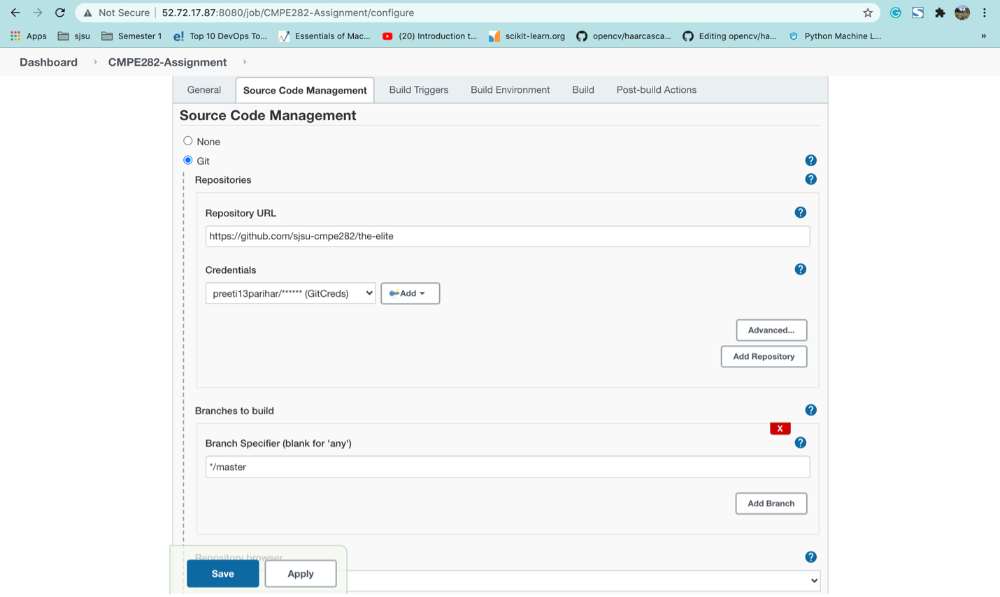
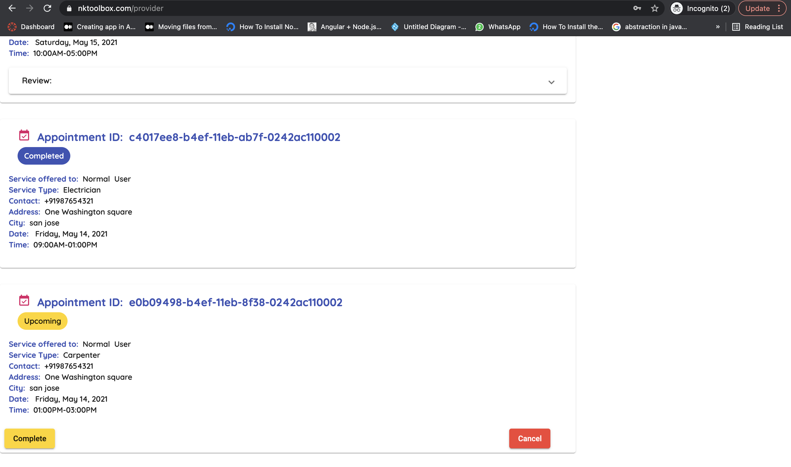

### University Name: http://www.sjsu.edu/

### Course: [Cloud Services]

### Demonstration of the Website: [YouTube Link](https://youtu.be/uIFMUfG9acE)

### Team Members
   ###### [ANANTH UPADHYA](https://www.linkedin.com/in/560085/)
   ###### [DEESHA DESAI](https://www.linkedin.com/in/deeshadesai/)
   ###### [PREETI PARIHAR](https://www.linkedin.com/in/preetiparihar/)
   ###### [PRIYANKA DEVENDRAN](https://www.linkedin.com/in/priyanka-devendran-76244479/)
   
### Project Introduction
    Hire my services is a home service company, an online platform to find and hire personal and local housekeeping services. It is new marketplace which creates additional employment where the skilled providers can post their skills and availability for self-employment. On the other hand, it helps consumers to easily locate the right professional for a required job.
    Home service company allows the consumers to search for the required services and book the services with ease without going through the frustration of finding the required professional to provide the services at the doorstep. 
    Online business has become more convenient amidst current pandemic situation. Services such as beauty service, childcare services can be delivered at home therefore avoiding the unnecessary hassle to travel outside, making life simple and safe.  
    Our Hire My services application covers all the things mentioned above. It is a website through which the service providers can register and post the services and the consumer can login, update their profiles and request services from service providers.

   ###### Feature List:
  
        1. PROVIDER
        * Register for services
        * Accept requested appointments
        * Cancel the requested appointments
        * Update the Profile

        2. CONSUMER
        * Request for services
        * Cancel scheduled services
        * Rate the provider services
        * Update the profile


## Architect Diagram:


## UML Diagram


## [Project Board](https://trello.com/invite/b/a9uhsd3Z/cac9542dbbbb51d23d3ec2afe5f1bbce/cmpe282-cloudservices)
We maintained a project board on trello and had bi-weekly sprint where we met daily to discuss on the task progress. This help in collaboration, communication, feedback, resolving blockers, resolving depencies etc.

Sprint Backlog </br>

Sprint Inprogress </br>

Sprint InReview </br>

Sprint Completed </br>

### Pre-requisites Set Up:

###### Frontend:

Pre-requisites: 
```
Node.js -Version 12 https://nodejs.org/en/

Frontend Technologies: NPM,HTML, SCSS, Angular CLI, Angular 10, Angular-material, Bootstrap, JEST.

To run Angular application in local:

Run following commands in ‘/UI/hire-my-services/’ 

1)npm install -g @angular/cli
2)npm install
2)ng serve

Server will be running on ‘http://localhost:4200’ 
```

###### Backend APIs

* Requirements:

    set following environment variables values:

    ```
    AWS_ACCESS_KEY_ID = os.getenv("AWS_ACCESS_KEY_ID", None)
    AWS_SECRET_ACCESS_KEY = os.getenv("AWS_SECRET_ACCESS_KEY", None)
    AWS_REGION = os.getenv("AWS_REGION", None)
    COGNITO_USER_POOL_ID = os.getenv("COGNITO_USER_POOL_ID", None)
    COGNITO_APP_CLIENT_ID = os.getenv("COGNITO_APP_CLIENT_ID", None)
    S3_BUCKET = os.getenv("S3_BUCKET", None)
    S3_URL = os.getenv("S3_BUCKET", None)
    CLOUD_FRONT_URL = os.getenv("CLOUD_FRONT_URL", None)
    ```

    ```pip3 install -r requirements.txt```

    ```python3 flask_app.py```
    
 ### AWS Configuration Screenshots

#### AWS Cognito


#### AWS Amplify


#### AWS S3


#### AWS CloudFront


#### AWS DynamoDB


#### AWS Certificate Manager 


#### AWS Route53


### Automate Deployment 

#### Login Page


#### Jenkins Dashboard


#### Pipeline Configuration 





#### Build History 


#### Console Output 


#### Git Webhook


### Website Screenshots

#### Login


#### Customer Register


#### Provider Register


#### Customer Home Page(List of services)


#### Service Providers Page


#### Book Appointment


#### Customer Appointments


#### Review Provider


#### Provider Reviews


#### Customer Edit Profile


#### Provider Appointments


#### Provider Profile


###### Backend APIs Request and Response

* Create new user on terminal

```
    echo -n sampleuser@gmail.com:@SampleUser1234 | base64
```
Output
```
c2FtcGxldXNlckBnbWFpbC5jb206QFNhbXBsZVVzZXIxMjM0
```


1. ```http://<host-name>/account/signin```

    Request:
        * Add Authorization Header as follows:
        ```Authorization: Basic <Base64 username:password>```

    Response:
        ```{
            "status": 200,
            "success": false,
            "data": {
                    "accessToken": <access_token>,
                    "profile":{
                        <user profile data>
                    }
            }
        }```

2. ```http://<host-name>/account/signup```

    Request:
        * Add Authorization Header as follows:
        ```Authorization: Basic <Base64 username:password>```
        * Request Body
            <Pass request body in json as discussed>


3. ```http://<host-name>/account/signout```

    Pass access token obtain while signing in as Bearer token in request header
    Request:
        * Add Authorization Header as follows:
        ```Authorization: Bearer <access token>```

4. ```http://<host-name>/account/delete/<usertype>```

    Pass access token obtain while signing in as Bearer token in request header
    Request:
        * Add Authorization Header as follows:
        ```Authorization: Bearer <access token>```

    * Pass usertype in path parameter


5. ```http://<host-name>/account/profile/<usertype>```

    Request:
        * Pass access token obtain while signing in as Bearer token in request header
        * Pass usertype in path parameter
        
            * Add Authorization Header as follows:
            ```Authorization: Bearer <access token>```
        * Body: pass request body in json, make sure keyname are matching as discussed
    

6. ```http://<host-name>/account/profile/<usertype>/upload```

    Pass access token obtain while signing in as Bearer token in request header
    Request:
        * Add Authorization Header as follows:
        ```Authorization: Bearer <access token>```

    * Pass usertype in path parameter

    * Pass image in Form data, and make sure file key name is ```profile_image```


* Sample Provider Data
```
{
    "email": "david@gmail.com",
    "userType": "provider",
    "firstName": "David",
    "lastName": "Jhon",
    "address": "One Washington Square",
    "area": "Downtown",
    "city": "San Jose",
    "phone": "+11234567890",
    "time": "9:00AM-5:00PM",
    "days": ["Monday", "Tuesday"],
    "skillSet": [
        {
            "name": "Plumber",
            "price": 500
        }
    ]
}
```

* Sample Consumer Data

```
{
    "email": "alina@gmail.com",
    "userType": "consumer",
    "firstName": "Alina",
    "lastName": "Mccarthy",
    "address": "One Washington Square",
    "area": "Downtown",
    "city": "San Jose",
    "phone": "+11234567890"
}
```

7. To get the list of providers based on the skillSet:
   ``` http://127.0.0.1:5000/account/services ```
   
   API Request:
   ```
   Params:
   skillSet=‘name of the service to be fetched’
   
   API Response:

   [
    {
        "address": "Gunj circle",
        "area": "The New palace",
        "city": "Raichur",
        "days": [
            "Monday",
            "Tuesday",
            "Wednesday",
            "Thursday",
            "Friday"
        ],
        "email": "john.doe@mailinator.com",
        "firstname": "John",
        "image": "https://d2i70qtaco3lqu.cloudfront.net/maid.png",
        "lastname": "Doe",
        "phone": "+918796533222",
        "price": "600",
        "rating": "3.0",
        "review": [
            "The person did an amazing job and is very skilled in what he does",
            "Below average work"
        ],
        "time": "10:00AM-05:00PM",
        "uuid": "d3d6f4c9-9672-4937-bccf-bd19733cacb2"
    },
    {
        "address": "Whitehouse",
        "area": "MG Road",
        "city": "Washington ",
        "days": [
            "Monday",
            "Tuesday",
            "Wednesday",
            "Thursday",
            "Friday"
        ],
        "email": "donald.trump@mailinator.com",
        "firstname": "Donald",
        "image": "None",
        "lastname": "Trump",
        "phone": "+919876543221",
        "price": "200",
        "rating": "4.0",
        "review": [
            "Not bad",
            "Very Good"
        ],
        "time": "10:00AM-05:00PM",
        "uuid": "c3b3b606-f1de-415b-b623-0740a4629e87"
    }
   ]
   ```

8. To book an appointment
   ``` POST http://<hostname>/user/<userID>/appointments ```
   ```
    Request:
      * Add Authorization Header as follows:
      ```Authorization: Basic <Base64 username:password>```
      * Request Body
            <Pass request body in json>
   API Response:  Response on the appointment booked success or failure
   {
      "Status": "success",
	  "Message": "Successfully booked and appointment"
   }
   ```
9. To update an appointment status
   ``` PATCH http://<hostname>/users/<userID>/appointments/<appointmentID> ```
   ```
    Request: 
      * Add Authorization Header as follows:
      ```Authorization: Basic <Base64 username:password>```
      * Request Body
            {
	       "status": "completed"
	     }
    Response:
       {
          "Status": "success",
          "Message": "Successfully booked and appointment"
       }
   ```
9. To rate and review an appointments
   ``` PATCH http://<hostname>/users/<userID>/appointments/<appointmentID>/ratingAndReview ```
   ```
    Request:
     * Add Authorization Header as follows:
	  ```Authorization: Basic <Base64 username:password>```
     * Request Body
	 {
           "rating": "3"
           "review": "This person is very skilled at what he does"
	 }
    Response:
     {
	 "Status": "success"
	 "Message": "Successfully rated and reviewed the appointment"
     }
   ```
10. To get all the appointments booked by the provider:
   ``` http://127.0.0.1:5000/user/userID/providerAppointments ```
   
   API Response: Will get the list of all the appointments booked by the provider.
   
   ```
   [
    {
        "appointmentID": "924c3914-8d33-4142-a45e-9c4b41e85d0c",
        "city": "gandinagar",
        "customerAddress": "#23 2nd block,4th street,gandinagar 340021",
        "customerEmail": "xyz@gmail.com",
        "customerNumber": "+91 9823674512",
        "customerUsername": "Vishnu",
        "date": "13-Jan-2020",
        "day": "Mon",
        "rating": "6",
        "review": "The electrician is good at his work",
        "serviceType": "electrician",
        "status": "upcoming",
        "time": "09:15AM-11:30AM"
    },
    {
        "appointmentID": "924c3914-8d33-4142-a45e-9c4b41e85gtc",
        "city": "gandinagar",
        "customerAddress": "#743 2nd block,4th street,Tnagar gandinagar 340001",
        "customerEmail": "abc@gmail.com",
        "customerNumber": "7234781290",
        "customerUsername": "Bala",
        "date": "13-Feb-2020",
        "day": "Thr",
        "rating": "5",
        "review": "The electrician did an average work",
        "serviceType": "electrician",
        "status": "completed",
        "time": "02:30PM-03:30PM"
    },
   ]   
   ```
11. To get all the appointments booked by the Consumer:
   ``` http://127.0.0.1:5000/user/627userID/customerAppointments ```
   
   API Response: Will get the list of all the appointments booked by the Customer.
   
   ```
   [
    {
        "appointmentID": "924c3914-8d33-4142-a45e-9c4b41e85d0c",
        "city": "gandinagar",
        "customerAddress": "#23 2nd block,4th street,gandinagar 340021",
        "customerEmail": "xyz@gmail.com",
        "customerNumber": "+91 9823674512",
        "customerUsername": "Vishnu",
        "date": "13-Jan-2020",
        "day": "Mon",
        "rating": "6",
        "review": "The electrician is good at his work",
        "serviceType": "electrician",
        "status": "upcoming",
        "time": "09:15AM-11:30AM"
    },
    {
        "appointmentID": "924c3914-8d33-4142-a45e-9c4b41e85gtc",
        "city": "gandinagar",
        "customerAddress": "#743 2nd block,4th street,Tnagar gandinagar 340001",
        "customerEmail": "abc@gmail.com",
        "customerNumber": "7234781290",
        "customerUsername": "Bala",
        "date": "13-Feb-2020",
        "day": "Thr",
        "rating": "5",
        "review": "The electrician did an average work",
        "serviceType": "electrician",
        "status": "completed",
        "time": "02:30PM-03:30PM"
    },
   ]
   ```
